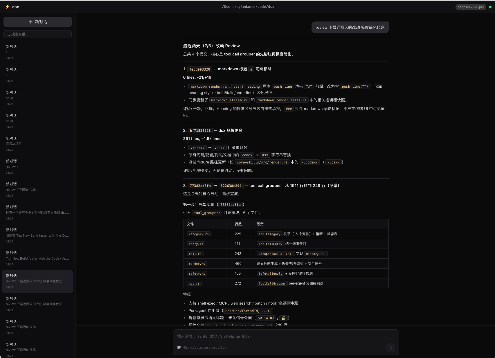

# dsx GUI

Web-based frontend for [dsx](https://github.com/cklxx/dsx) — a DeepSeek V4 agent built on the codex-rs framework.

Built with Vue 3 + Naive UI, served through a loopback-only Python proxy with a per-launch URL token. The proxy connects to the dsx app-server over loopback WebSocket JSON-RPC.



## Features

- **Chat interface** — streaming assistant responses with markdown rendering (GFM)
- **Tool call grouping** — consecutive tool calls collapsed into a single card, auto-expands on running/failed
- **Thread management** — sidebar with search, create/switch/delete threads
- **Reasoning toggle** — thinking steps hidden by default, click to expand
- **Interrupt** — Esc or button to stop generation mid-stream
- **Dark theme** — matching dsx TUI aesthetics

## Quick start

```bash
./start.sh
```

This builds the Vue app (`npm install && npm run build`) and starts the proxy server.

The launcher opens the tokenized loopback URL automatically. Do not remove the `?token=...` query parameter.

### Requirements

- dsx CLI available on `PATH`
- Node.js (for build)
- Python 3 (for proxy)

## Architecture

```
Browser (Vue 3 SPA, tokenized loopback URL)
    │
    ▼ HTTP/WebSocket 127.0.0.1:9021
Python proxy (same-origin + token validation)
    │
    ▼ WebSocket 127.0.0.1:9020
dsx app-server (codex-rs)
```

### Key files

| File | Purpose |
|------|---------|
| `src/composables/useRpc.js` | WebSocket JSON-RPC client; privileged requests are declined until an approval UI exists |
| `src/composables/useApp.js` | App state, thread/turn/message management |
| `src/components/ChatView.vue` | Message list with render-block grouping logic |
| `src/components/MessageGroup.vue` | User/assistant/reasoning message rendering |
| `src/components/ToolGroup.vue` | Aggregated tool call card |
| `src/components/Composer.vue` | Input area with auto-resize |
| `src/components/Sidebar.vue` | Thread list |
| `server.py` | Static file server + WebSocket proxy |

## Development

```bash
# Dev server with HMR
npm run dev

# Build for production (outputs to dist/)
npm run build
```

The proxy (`server.py`) serves `dist/` as static files and proxies WebSocket connections to the app-server.
